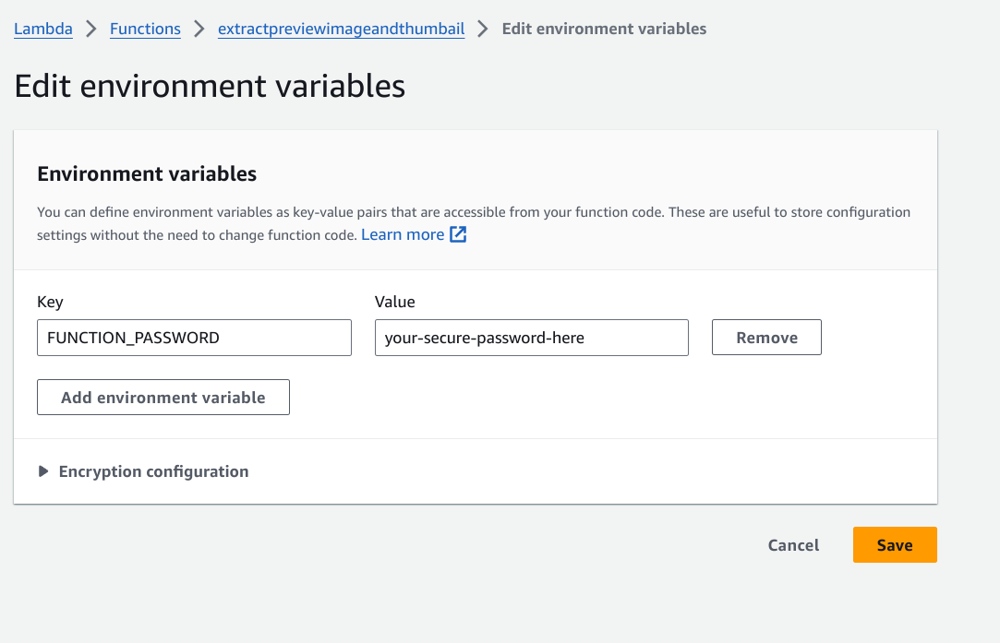
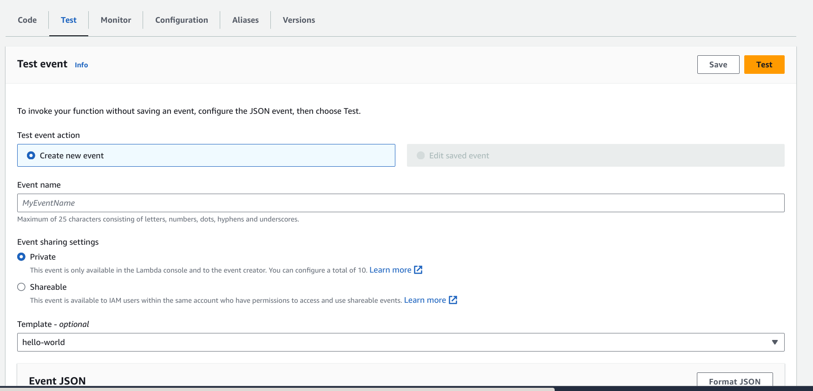

## Use IAM Give the Lambda function S3 permissions

## Use a password to protect



## Increae timeout and Memory Limit

## Test the lambda function




```
{
  "password": "your-secure-password-here",
  "url": "https://public.jimchen.me/other/9c90a31b-8bc3-4299-9911-f7ebba67c0d4-2 Hours of Daily Russian Conversations - Russian Practice for ALL Learners [PEidRnRXA90].webm",
  "s3ObjectKey": "9c90a31b-8bc3-4299-9911-f7ebba67c0d4-2 Hours of Daily Russian Conversations - Russian Practice for ALL Learners [PEidRnRXA90]",
  "previewImageTimestamp": "00:00:05",
  "previewVideoStart": "00:00:00",
  "previewVideoEnd": "00:00:10",
  "bucket": "jimchen4214-public"
}
```

## Return

```
{
  "statusCode": 200,
  "body": "{\"previewImageUrl\": \"https://jimchen4214-public.s3.amazonaws.com/9c90a31b-8bc3-4299-9911-f7ebba67c0d4-2 Hours of Daily Russian Conversations - Russian Practice for ALL Learners [PEidRnRXA90]_preview.jpg\", \"previewVideoUrl\": \"https://jimchen4214-public.s3.amazonaws.com/9c90a31b-8bc3-4299-9911-f7ebba67c0d4-2 Hours of Daily Russian Conversations - Russian Practice for ALL Learners [PEidRnRXA90]_previewVideo.gif\"}"
}
```